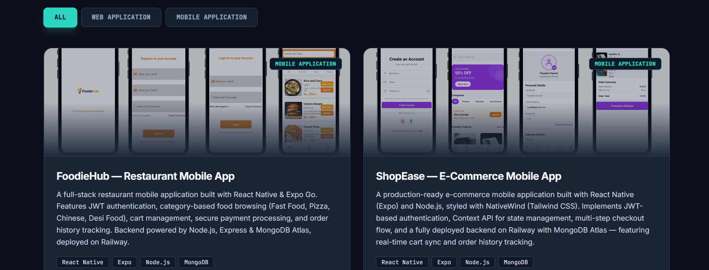
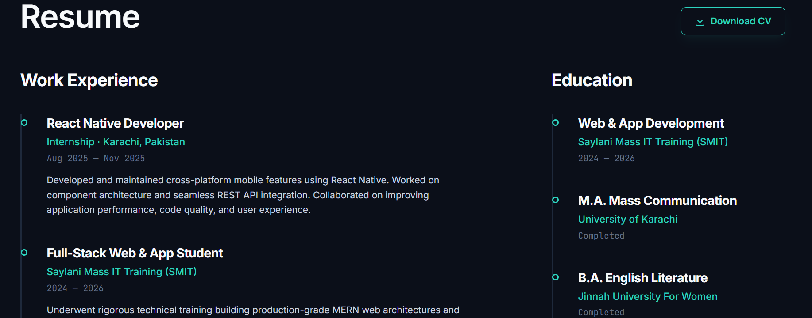
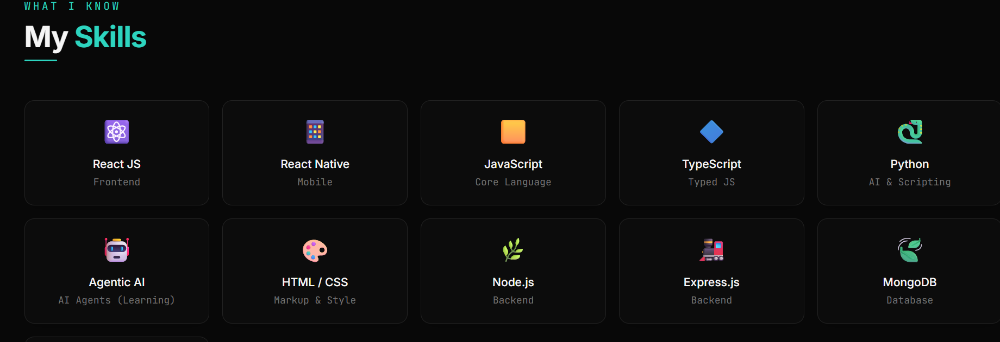
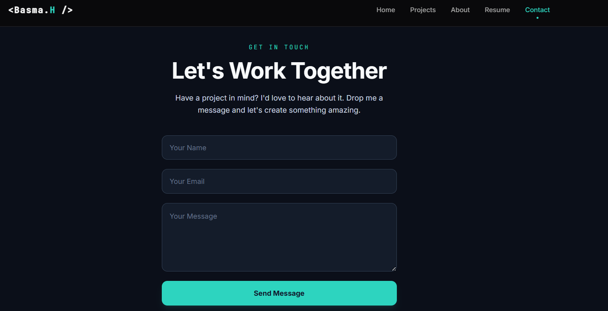
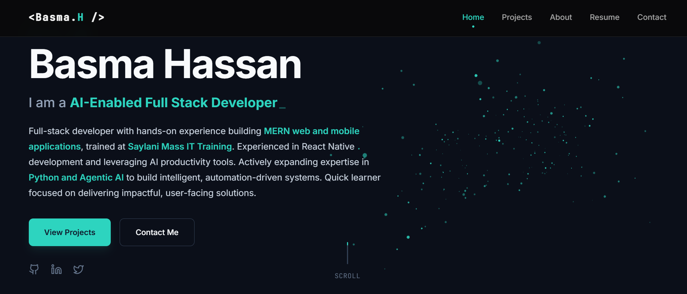

# 🌐 Basma Hassan — Developer Portfolio

[](https://basma-portfolio-mu.vercel.app)
[](https://reactjs.org)
[](https://typescriptlang.org)
[](https://tailwindcss.com)

> Personal portfolio website showcasing my skills, projects, and experience as a Full Stack & React Native Developer.

---

## 🔗 Live Site

**[basma-portfolio-mu.vercel.app](https://basma-portfolio-mu.vercel.app)**

---

## 📸 Preview



---

## ✨ Features

- Smooth GSAP scroll animations
- Typewriter effect with multiple roles
- Particle wave background
- Fully responsive design
- Dark theme with teal accent
- Animated loading screen
- Projects filter by category
- Resume section with skills & certifications
- Contact form

---

## 🛠️ Tech Stack

| Category | Technologies |
|----------|-------------|
| Frontend | React 18, TypeScript, Tailwind CSS |
| Animation | GSAP, ScrollTrigger |
| Mobile | React Native |
| Backend | Node.js, Express.js |
| Database | MongoDB |
| Other | Next.js, Python, Agentic AI |

---

## 📁 Project Structure

```
src/
├── sections/
│   ├── Hero.tsx
│   ├── About.tsx
│   ├── Projects.tsx
│   ├── Skills.tsx
│   ├── Resume.tsx
│   ├── Contact.tsx
│   ├── Navigation.tsx
│   ├── Footer.tsx
│   └── LoadingScreen.tsx
├── hooks/
├── lib/
├── App.tsx
└── App.css
```

---

## 🚀 Getting Started

```bash
# Clone the repo
git clone https://github.com/Basma-Hassan95/basma-portfolio.git

# Navigate to project
cd basma-portfolio

# Install dependencies
npm install

# Run locally
npm start
```

---

## 📬 Contact
   
📧 Email: hassanbasma001@gmail.com
🌐 Portfolio: basma-portfolio-mu.vercel.app
💼 LinkedIn: Basma Hassan
📱 WhatsApp: +92 319 1869136
---

<p align="center">Made with ❤️ by Basma Hassan</p>